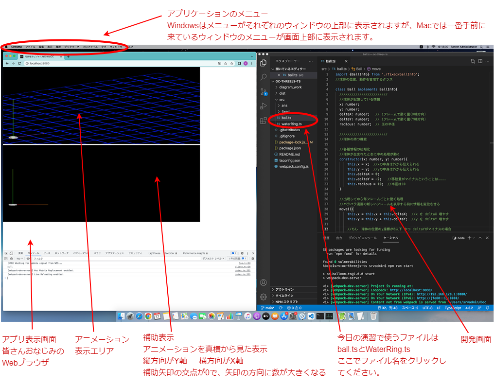
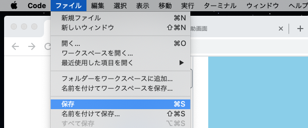
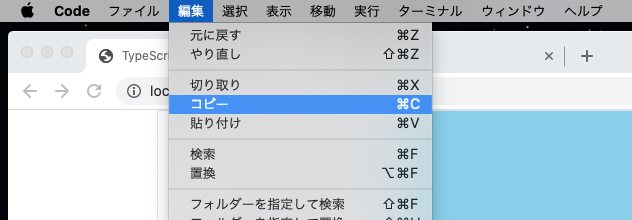

(補助資料)
# 画面と操作について

## 作業画面

## プログラムの変更をアプリ表示画面に反映
開発画面でプログラムを書き換えたら、ファイルを保存するとアプリ表示画面が更新されます。保存は、上部メニューの「ファイル」から「保存」をクリックしてください。
**ファイル**の右に**Code**と表示されていなければなりません。そうなっていなければ、開発画面をクリックしてください。  
  

## コピー、ペースト機能の利用
Windowsと同様に、開発画面でコピー、ペースト機能が利用できます。開発画面でコピーしたい部分をマウスで選択したら、上部メニューの「編集」から「コピー」をクリックしてください。
貼り付けたい場所にカーソルを移動させ、上部メニューの「編集」から「貼り付け」をクリックしてください。  
  

